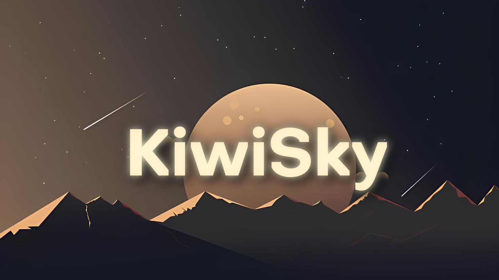

I'm yKiwiSky

I'm a gamedev student, I am 19 years old, I've developed 8 games at total, some part made on Clickteam Fusion 2.5+ and in 2022 I started developing with Lua using Löve2D and Haxe.

- ⚙️ I’m currently working on "⬜🔺"
- 💡 I’m currently learning SQL and database stuff
- ❤️ Pronouns: He/She
---

## Socials

## Tecnologias que eu uso :3
 

 

![Static Badge](https://img.shields.io/badge/-windows-6d3b8e?style=for-the-badge&logoSize=auto&labelColor=ffc956&color=6d3b8e&logo=data:image/svg+xml;base64,PD94bWwgdmVyc2lvbj0iMS4wIiBlbmNvZGluZz0iVVRGLTgiIHN0YW5kYWxvbmU9Im5vIj8+CjwhLS0gVXBsb2FkZWQgdG86IFNWRyBSZXBvLCB3d3cuc3ZncmVwby5jb20sIEdlbmVyYXRvcjogU1ZHIFJlcG8gTWl4ZXIgVG9vbHMgLS0+Cgo8c3ZnCiAgIHdpZHRoPSI4MDAiCiAgIGhlaWdodD0iODAwIgogICB2aWV3Qm94PSIwIDAgMjAgMjAiCiAgIHZlcnNpb249IjEuMSIKICAgaWQ9InN2ZzEiCiAgIHhtbG5zPSJodHRwOi8vd3d3LnczLm9yZy8yMDAwL3N2ZyIKICAgeG1sbnM6c3ZnPSJodHRwOi8vd3d3LnczLm9yZy8yMDAwL3N2ZyI+CiAgPHRpdGxlCiAgICAgaWQ9InRpdGxlMSI+d2luZG93cyBbIzE3NF08L3RpdGxlPgogIDxkZXNjCiAgICAgaWQ9ImRlc2MxIj5DcmVhdGVkIHdpdGggU2tldGNoLjwvZGVzYz4KICA8ZGVmcwogICAgIGlkPSJkZWZzMSIgLz4KICA8ZwogICAgIGlkPSJQYWdlLTEiCiAgICAgc3Ryb2tlPSJub25lIgogICAgIHN0cm9rZS13aWR0aD0iMSIKICAgICBmaWxsPSJub25lIgogICAgIGZpbGwtcnVsZT0iZXZlbm9kZCIKICAgICBzdHlsZT0iZmlsbDojMDBiMGZmO2ZpbGwtb3BhY2l0eToxIj4KICAgIDxnCiAgICAgICBpZD0iRHJpYmJibGUtTGlnaHQtUHJldmlldyIKICAgICAgIHRyYW5zZm9ybT0idHJhbnNsYXRlKC02MCwtNzQzOSkiCiAgICAgICBmaWxsPSIjMDAwMDAwIgogICAgICAgc3R5bGU9ImZpbGw6IzAwYjBmZjtmaWxsLW9wYWNpdHk6MSI+CiAgICAgIDxnCiAgICAgICAgIGlkPSJpY29ucyIKICAgICAgICAgdHJhbnNmb3JtPSJ0cmFuc2xhdGUoNTYsMTYwKSIKICAgICAgICAgc3R5bGU9ImZpbGw6IzAwYjBmZjtmaWxsLW9wYWNpdHk6MSI+CiAgICAgICAgPHBhdGgKICAgICAgICAgICBkPSJtIDEzLjE0NTg2NSw3Mjg5LjQzNDMgYyAwLjAwNSwxLjk5ODkgMC4wMTEwMyw1LjM5NSAwLjAxNjA0LDguMDM0NSAzLjYxNDAzNSwwLjQ4ODggNy4yMjgwNywwLjk5MjUgMTAuODM2MDksMS41MzEyIDAsLTMuMTUxMyAwLjAwNCwtNi4yODg1IDAsLTkuMjg2OSAtMy42MTcwNDMsMCAtNy4yMzMwODMsLTAuMjc4OCAtMTAuODUyMTMsLTAuMjc4OCBtIC05LjE0NTg2NSwwIHYgNi43ODYyIGMgMi43MjU4MTQ1LDAuMzY3OCA1LjQ1MTYyOTEsMC43MTk2IDguMTcyNDMxLDEuMTIxNCAwLjAwNSwtMi42MjU1IC0wLjAwMiwtNS4yNTIxIC0wLjAwMiwtNy44Nzc3IC0yLjcyMzgwOTUsMC4wMSAtNS40NDY2MTY1LC0wLjAzOSAtOC4xNzA0MjYsLTAuMDMgbSAwLC03LjU5MTkgdiA2Ljc2NzMgYyAyLjcyNTgxNDUsMC4wMSA1LjQ1MTYyOTEsLTAuMDM0IDguMTc3NDQ0LC0wLjAzMSAtMC4wMDIsLTIuNjE5NSAtMC4wMDIsLTUuMjM2MSAtMC4wMDUsLTcuODU1NyAtMi43Mjc4MTk1LDAuMzQwOSAtNS40NTU2MzksMC43MDE3IC04LjE3MjQzMSwxLjExOTQgbSAyMCw2LjYyODQgYyAtMy42MTIwMywwLjAxNCAtNy4yMjQwNiwwLjA2OSAtMTAuODM4MDk1LDAuMDggLTAuMDAyLC0yLjY2MjUgLTAuMDAyLC01LjMyMiAwLC03Ljk4MjYgMy42MDcwMTcsLTAuNTUwNyA3LjIyMjA1NSwtMS4wNjg0IDEwLjgzNjA5LC0xLjU2OTEgMC4wMDIsMy4xNTgzIDAsNi4zMTM1IDAuMDAyLDkuNDcxOCIKICAgICAgICAgICBpZD0id2luZG93cy1bIzE3NF0iCiAgICAgICAgICAgc3R5bGU9ImZpbGw6IzAwYjBmZjtmaWxsLW9wYWNpdHk6MSIgLz4KICAgICAgPC9nPgogICAgPC9nPgogIDwvZz4KPC9zdmc+Cg==)
 

![Static Badge](https://img.shields.io/badge/-love2D-6d3b8e?style=for-the-badge&logoSize=auto&labelColor=ffc956&color=6d3b8e&logo=data:image/svg+xml;base64,PD94bWwgdmVyc2lvbj0iMS4wIiBlbmNvZGluZz0iVVRGLTgiIHN0YW5kYWxvbmU9Im5vIj8+CjwhLS0gR2VuZXJhdG9yOiBBZG9iZSBJbGx1c3RyYXRvciAxNi4wLjAsIFNWRyBFeHBvcnQgUGx1Zy1JbiAuIFNWRyBWZXJzaW9uOiA2LjAwIEJ1aWxkIDApICAtLT4KCjxzdmcKICAgdmVyc2lvbj0iMS4xIgogICBpZD0iTGF5ZXJfMSIKICAgeD0iMHB4IgogICB5PSIwcHgiCiAgIHdpZHRoPSIxNDEuNzMiCiAgIGhlaWdodD0iMTQxLjczIgogICB2aWV3Qm94PSIwIDAgMTQxLjczIDE0MS43MyIKICAgZW5hYmxlLWJhY2tncm91bmQ9Im5ldyAwIDAgMTQxLjczIDE0MS43MyIKICAgeG1sOnNwYWNlPSJwcmVzZXJ2ZSIKICAgeG1sbnM9Imh0dHA6Ly93d3cudzMub3JnLzIwMDAvc3ZnIgogICB4bWxuczpzdmc9Imh0dHA6Ly93d3cudzMub3JnLzIwMDAvc3ZnIj48ZGVmcwogICBpZD0iZGVmczgiIC8+CjxnCiAgIGlkPSJnMyI+CgkKCTxnCiAgIGlkPSJnMiI+CgkJPHBhdGgKICAgZmlsbD0iI2U3NGE5OSIKICAgZD0iTSAxMTUuNzI2LDE4LjQxMyBDIDExNS43MSwxOC4zOTYgMTE1LjY5MSwxOC4zODYgMTE1LjY3MywxOC4zNzEgOTQuMzA3LDAuMDE0IDY0LjExOCwtMy4yNDMgMzkuMTM2LDkuNTIzIDE0LjE2OCwyMi4yODIgLTAuMDQ0LDUwLjczMyAzLjM4Miw3OC4zMDYgYyAyLjM5MiwxOS4yNjggMTMuMTI5LDM2LjE2NSAyOC40NjYsNDcuMDIxIDAsMCA0Mi4yNzcsLTM3Ljc3NiA1My41MDQsLTUxLjE4MSAxMC41MywtMTIuNTgyIDMzLjUyLC01Mi43NjQgMzMuNTIsLTUyLjc2NCAtMS4wMTEsLTEuMDE3IC0yLjA1OCwtMi4wMDggLTMuMTQ2LC0yLjk2OSB6IgogICBpZD0icGF0aDIiIC8+Cgk8L2c+CjwvZz4KPGcKICAgaWQ9Imc2Ij4KCQoJPGcKICAgaWQ9Imc1Ij4KCQk8cGF0aAogICBmaWxsPSIjMjdhYWUxIgogICBkPSJtIDMxLjg0OSwxMjUuMzI3IGMgNy4wNjcsNS4wMDEgMTUuMTEsOC43MjYgMjMuNzY1LDEwLjgwMSAyNy4wNzYsNi40ODcgNTYuMjcsLTUuMjkzIDcxLjc1OSwtMjguMjYxIDE4LjI1NiwtMjcuMDc3IDE0LjI0MSwtNjMuNjQ5IC04LjUsLTg2LjQ4NSAwLDAgLTMyLjQ2NCwzOC43NzggLTQzLjI4Nyw1MS43MDYgLTEwLjkzNiwxMy4wNTggLTQzLjczNyw1Mi4yMzkgLTQzLjczNyw1Mi4yMzkgeiIKICAgaWQ9InBhdGg0IiAvPgoJPC9nPgo8cGF0aAogICBmaWxsPSIjZmZmZmZmIgogICBkPSJtIDczLjA0Myw1Mi44IGMgMCwwIC02LjQ4LC0xNC4xODcgLTE5Ljk2OCwtMTAuOTU4IC0xMy40ODYsMy4yMyAtNDEuNjUyLDMwLjc5MiAxNy44NTMsNjUuMDgzIEggNzAuODggQyAxMzAuMzg0LDcyLjYzNCAxMDIuMjIsNDUuMDczIDg4LjczMyw0MS44NDIgNzUuMjQ1LDM4LjYxMyA2OC43NjYsNTIuOCA2OC43NjYsNTIuOCBaIgogICBpZD0icGF0aDYiIC8+PC9nPgoKPC9zdmc+Cg==)
 

