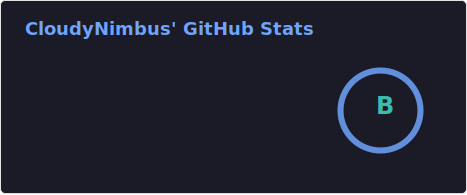
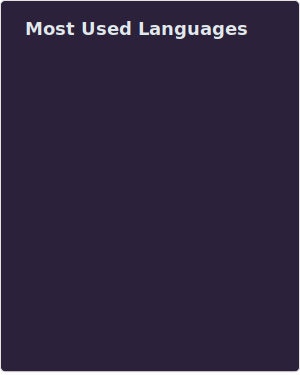

## Yoii! Sou CloudyNimbus

tenho 21 anos, moro no Brasil.
Estava estudando Jogos Digitais, agora inicio em Analise e desenvolvimento de sistemas.
Comecei com 12 anos tentando construir uma fangame de Five Night's At Freddy's usando a Clickteam Fusion 2.5
Hoje em dia me especializo em Love2D e outros frameworks e game engines.
Estou estudando não somente temas relacionado a desenvolvimento de jogos, mas tambem sistemas operacionais, linguagens de programação e qualquer coisa que eu me interessar no momento.

```lua
function main()
  local username = "CloudyNimbus"
  local isGameDev = true
  local nationality = Nations.Brazil
  local discordUser = "cloudy.nimbus_"
  local pronouns = { Pronoun.He, Pronoun.She },
  local speakLanguages = { Language.English, Language.BrazillianPortuguese }
  local isAutist = true -- lol
  local stack = {
    "VSCode",
    "Aseprite",
    "Audacity",
    "LMMS",
    "Love2D",
    "Lover - Builder"
  }
  local languagesKnownledge = {
    "[C#] - Unity",
    "[C] - Raylib",
    "[Haxe] - RaylibHX, HaxeFlixel",
    "[Lua] - Love2D, Roblox",
    "[Typescript] - Kaplay",
    "[Python] - Pygame",
  }

  return 0
end
```
---





## Redes sociais

<a href="https://gamejolt.com/@ItzKiwiSky"></a><br>
<br>
<a href="https://kiwisugar.itch.io/"></a>
<br>


