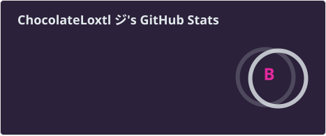
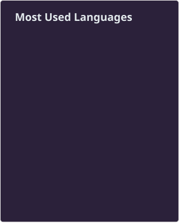

## Yoii! Sou CloudyNimbus

Tenho 21 anos, moro no Brasil.
Sou dev de jogos independente e amante de tecnologia.
Atuo no desenvolvimento de jogos do zero, com 10 anos de experiencia em programação de jogos, iniciei minha carreira com 12 anos tentando construir uma fangame de Five Night's At Freddy's usando a Clickteam Fusion 2.5
Hoje em dia me especializo em Love2D e outros frameworks e game engines, alem de desenvolver ferramentas e soluções para outros desenvolvedores, ferramentas internas e utilitários open source.

Gosto de muito da area em que atuo, mas não me limito somente a ela, quando tenho interesse em algum assunto eu vou fundo nele, recentemente venho estudando sobre sistemas operacionais e linguagens de programação

```haxe
public class CloudyNimbus extends Developer
{
  public function new()
  {
    super();
    this.username: String = "CloudyNimbus";
    this.isGameDev: Bool = true;
    this.nationality: UserNationalities = Nations.Brazil;
    this.discordUser: String = "eclipsenimbus_";
    this.pronouns: UserPronuns = { UserPronuns.He, UserPronuns.She };
    this.speakLanguages: UserLanguages = { UserLanguages.English, UserLanguages.BrazillianPortuguese };
    this.isAutist: Bool = true; // XDD

    this.tools: Array<String> = [
      "VSCode",
      "Aseprite",
      "Audacity",
      "LMMS",
      "Love2D",
      "Lover - Builder"
    ];

    this.languagesKnownledge: Array<String> = [
      "[C#] - Unity, RaylibCS",
      "[C] - Raylib",
      "[Haxe] - RaylibHX, HaxeFlixel",
      "[Lua] - Love2D, Roblox",
      "[Typescript] - Kaplay",
      "[Python] - Pygame",
    ]
  }
}
```

---





## Redes sociais

<a href="https://gamejolt.com/@itzNimbusEclipse"></a><br>
<br>
<a href="https://kiwisugar.itch.io/"></a>
<br>
